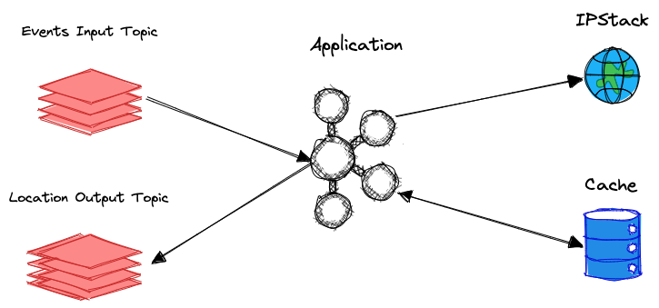

# croct-app
<br>
Este desafio é proposto para criar um aplicativo de fluxo Kafka autônomo que traduz IPs em localizações geográficas usando a API gratuita do IPStack.
<br>
<br>
Vamos lá! 🚀
<br>
<br>

# Missão Croct! 🟢
<br>

<p align="center">
  
</p>

<br>
<br>

**Evento**

Receber uma sequência de eventos de IP em um tópico utilizando Kafka
<br>
<br>


**Buscar localização**

Tendo o registro mantido no tópico, devemos buscar a localização de tal IP utilizando a API da IPStack
<br>
<br>

**Registrar localização**

Havendo obtido a localização de tal IP, devemos interpretar o retorno da API e disponibilizar as informações em um novo tópico Kafka
<br>
<br>
<br>


### Tecnologias 🔧

As seguintes ferramentas foram utilizadas para construção desta aplicação:

- Node.js ([nodejs.org](http://nodejs.org/))
- Express ([expressjs.com](http://expressjs.com/))
- Nodemon ([nodemon.io](https://nodemon.io/))
- Docker ([docker.com](https://www.docker.com/))
- API IP Stack ([ipstack.com](https://ipstack.com/))
- Kafka ([kafka.js.org](https://kafka.js.org/))
<br>
<br>

### Pré-requisitos

Antes de começar será necessário ter instalado em sua máquina a ferramenta [Docker](http://docker.com) e o Docker Compose. Com esta será possível criar uma imagem do projeto e executar todas as suas funções. Além deste precisaremos também do [Node.js](http://nodejs.org/).
<br>
<br>

### Rodando a aplicação 🏈

```bash
# Clonar o repositório
$ git clone https://github.com/leodoima/croct-app.git

# Ir para a pasta raiz do projeto
$ cd croct-app

# Criando o container docker
$ sudo docker compose up -d

# Executar produtor de eventos (producer)
$ node ./src/services/producer.js

# Executar leitor dos eventos (consumer)
$ node ./src/services/streamer.js

# Caso queira saber se a aplicação está rodando
$ node index.js
$ http://localhost:3000/
```
<br>
<br>

### Melhorias futuras 🔨

- [x]  Utilizar ferramenta específica de streaming (pode ser: https://nodefluent.github.io/kafka-streams/)
- [x]  Realizar busca de endereços apenas para um mesmo ID após 30 minutos
- [x]  Incluir testes automatizados
